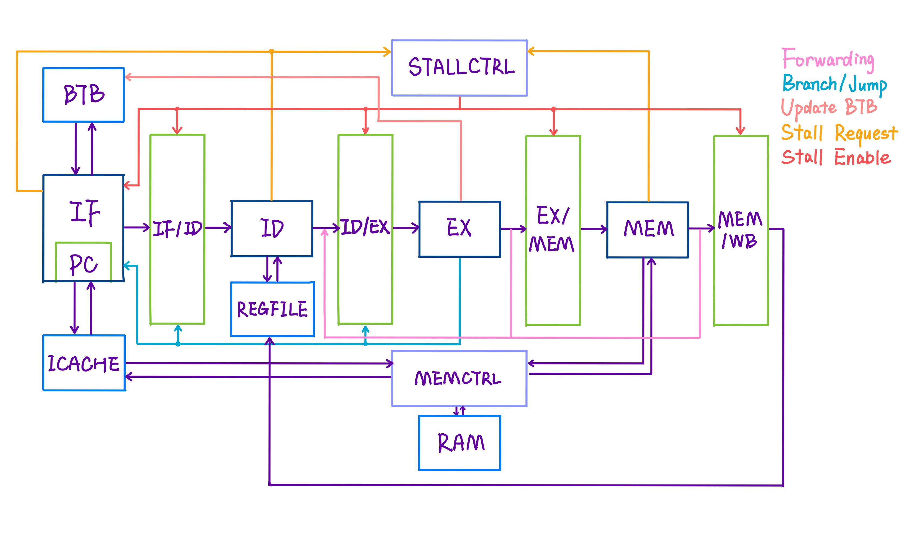

# RISC-V CPU Project Report

MS108 - Computer System(1) - Computer Architecture Project.
A standard 6-stage pipeline CPU that implements RV32I with Verilog HDL.
2019 Fall


## Design




## Features

* **6-stage Pipelining**
  Not 5-stage pipeline since the IF stage is divided into two stages for better performance. And the IF stage is implemented with sequential circuit. See [major difficulties](https://github.com/MasterJH5574/RISC-V_CPU#extra-timing-caused-by-if) below for details.
* **Memory Controller**
  Maybe it is not a feature. I write it here because I think my Memory Controller is implemented badly hence it may cause several cycles of latency when RAM structural hazard occurs.
  
* **Instruction Cache**
  A 128*4-byte, direct mapping cache.
  It takes 1 cycle when cache hit. Otherwise, I-Cache will send request to Memory Controller at the beginning of the next cycle(sequential circuit). Sadly, it takes 8 cycles to fetch a new instruction from RAM.
* **Branch Target Buffer**
  A 8-entry, direct mapping, standard BTB. 
  IF send request and receive the result to and from BTB and I-Cache at the same time.
  The accuracy is about 80%.
  Accuracy will increase 1% if the BTB is enlarged to 32 entries. So I think 8 entries are enough for my BTB.


## Timeline

Please refer to [my commits](https://github.com/MasterJH5574/RISC-V_CPU/commits/master), though it is not very thorough.


## Performance on FPGA

190MHz can be achieved, WNS = -5.216ns

| Test Case | Time |
| :--: | :--: |
| array_test1 | 0.000 |
| array_test2 | 0.016 |
| basicopt1 | 0.031 |
| bulgarian | 1.140 (sleep(15)) |
| expr | 0.016 |
| gcd | 0.016 |
| hanoi | 1.469 |
| lvalue2 | 0.016 |
| magic | 0.016 |
| manyarguments | 0.000 |
| multiarray | 0.000 |
| pi | 0.938 |
| qsort | 5.859 (sleep(2)) |
| statement_test | 0.016 |
| superloop | 0.000 |
| tak | 0.047 |
| heart (by 于峥) | 355.000 |


## Major Difficulties

#### Memory Controller

How to design Memory Controller?

#### Instruction Cache

And how to design Instruction Cache and add I-Cache between IF and Memory Controller?

#### Extra Timing Caused by IF

The IF stage runs too slowly, since cache hit takes a lot of time and the route IF to I-Cache to IF to IF/ID cannot fit in one cycle. So inspired by 计家宝 and 郭林松, I divide the IF stage into two substages. In the first cycle, IF send request to I-Cache and I-Cache returns the requested instruction to IF. In the next cycle, IF send the instruction to IF/ID. Note that Combinational Circuit can be no longer used since IF need to store the instruction fetched from I-Cache.

For this problem, I also put PC into IF module, and I get better performance.

#### Extra Timing when EX updates BTB

My first design of handling BTB update in EX runs too slowly. I guess that two combinational circuit in EX trigger each other and this leads to extra time, so updating BTB becomes the critical path. Upon locating this problem, I merged the two combinational circuit into one. And the WNS was reduced as expected.

#### Latency Caused by BTB Hit

Since the IF stage is divided into two stages, I use 2 PCs to store the PC send to BTB/I-Cache and the PC send to IF/ID. So it takes 1 cycle to refresh PCs so that I can fetch the correct instruction from I-Cache in the next cycle. I tried to reduce the extra cycle, but I made no progress on it.

#### Others

I'm certain that I meets many other small difficulties, but sadly I didn't make a record of them.


## Some of My Thoughts

* **I didn't refer to anyone's code except *自己动手写CPU* written by 雷思磊.** Thinking of the project of former courses, I find myself always referring to my peers' code, and I think it is not a good habit. So this time I want to challenge myself. However, it also raises some different problems. For instance, I miss some chances to learn from others' good way of coding, so the latencies are high, and the performance may be not very good.

* **The code is in a mess. More change, more mess.** Maybe I cannot tell what I was thinking when implementing a specific module, especially IF and Memory Controller. I never reconstruct any module because I think it troublesome. But if I have tried to reconstruct my Memory Controller or IF, maybe I can get much better performance. Who knows?

* **Lack of communications with others.** If I always communicate my ideas(whether good or bad) with others, maybe I will get inspired and will have a better design.

* **Lack of timeline.** It is much harder to summary my project without a timeline.

* **Not too much original ideas. Didn't try to explore on my own.** By now, I don't know how `hci.v` and `riscv_top.v` work. I don't know how my code is implemented into a specific design. I don't know how LUT and FF come from. I don't know how to optimize my code by referring to the critical path. There are too many things I don't know.

  I can say that I didn't have too much time to do some research, but... I'd better regard "not enough time" as an excuse.

  Full of pity.


## Acknowledgement

* Special thanks to 金弘义 for his guidance, patience and inspirations.
* Thanks to TA 李照宇 for his kindly help.
* Thanks to 郭林松 and 计家宝 for their ideas to split the IF stage.
* Thanks to 侯博涵 for his RISC-V simulator used for debugging use.
* Thanks to 于峥 for his stress test `heart.c`. See [Appendix](https://github.com/MasterJH5574/RISC-V_CPU#appendix) for the code.
* And anyone who helped me, comforted me and inspired me. **THANK YOU ALL!!!**


## References

* 雷思磊. *自己动手写CPU*, 电子工业出版社, 2014


## Appendix

`heart.c`

```c
#include "io.h"
#define putchar outb
float f(float x, float y, float z) {
    float a = x * x + 9.0f / 4.0f * y * y + z * z - 1;
    return a * a * a - x * x * z * z * z - 9.0f / 80.0f * y * y * z * z * z;
}

float h(float x, float z) {
    for (float y = 1.0f; y >= 0.0f; y -= 0.001f)
        if (f(x, y, z) <= 0.0f)
            return y;
    return 0.0f;
}

float mysqrt(float x) {
  if (x == 0) return 0;
  int i;
  double v = x / 2;
  for (i = 0; i < 50; ++i)
    v = (v + x / v)/2;
  
  return v;
}

int main() {
    for (float z = 1.5f; z > -1.5f; z -= 0.05f) {
        for (float x = -1.5f; x < 1.5f; x += 0.025f) {
            float v = f(x, 0.0f, z);
            if (v <= 0.0f) {
                float y0 = h(x, z);
                float ny = 0.01f;
                float nx = h(x + ny, z) - y0;
                float nz = h(x, z + ny) - y0;
                float nd = 1.0f / mysqrt(nx * nx + ny * ny + nz * nz);
                float d = (nx + ny - nz) * nd * 0.5f + 0.5f;
                int index = (int)(d * 5.0f);
                putchar(".:-=+*#%@"[index]);
            }
            else
                putchar('_');
            //sleep(1);
        }
        putchar('\n');
    }
}
```

